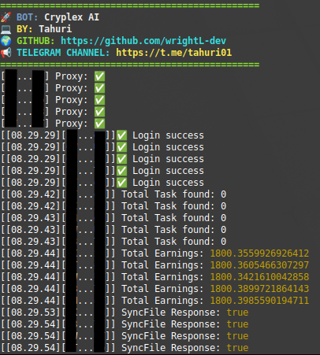

# BOT CRYPLEX



**Fitur:**

**• Auto Connect**

**• Auto Sync File**

**• Auto Clear Task**

**• Supports Proxy w/o Proxy**

## Requirements

Before running this project, make sure you have installed:

- Node.js
- npm (Node Package Manager)

## Installation

1. **Clone this repository:**

    ```plaintext
    git clone https://github.com/wrightL-dev/CPX
    cd CPX

2. **Install the required packages:**

    ```plaintext
    npm install axios user-agents @solana/web3.js bs58 bip39 ed25519-hd-key tweetnacl https-proxy-agent

3. **Add your accounts in the accounts.txt file. Example:**

    ```plaintext
   privatekey: abcdef
   privatekey: abcdef
   privatekey: abcdef
   privatekey: abcdef
   privatekey: abcdef

4. **If you want to use a proxy, edit the proxy.txt file. Example:**
   ```plaintext
   http://username:password@ip:port
   http://username:password@ip:port
   http://username:password@ip:port
   http://username:password@ip:port
   http://username:password@ip:port

5. **Run the script:**
   ```plaintext
   node cryplex.js
   
## Support

If you have any questions or need further assistance, feel free to join our Telegram channel at [t.me/tahuri01](https://t.me/tahuri01).

## License

This project is licensed under the [MIT License](LICENSE).
